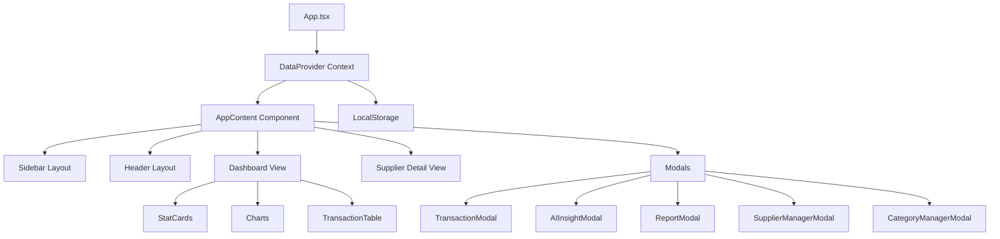

# Báo Cáo Chi Tiết Dự Án FinTrack

## 📋 Tổng Quan Dự Án

### Thông tin cơ bản
- **Tên dự án**: FinTrack - Sổ Quỹ Đa Chi Nhánh
- **Mục đích**: Hệ thống quản lý quỹ tiền mặt và ngân hàng cho doanh nghiệp đa chi nhánh
- **Công nghệ**: React 19 + TypeScript + Vite
- **Tính năng nổi bật**: Quản lý giao dịch, theo dõi công nợ nhà cung cấp, phân tích AI với Gemini

### Mô tả chức năng
FinTrack là ứng dụng web quản lý tài chính cho phép:
- Theo dõi thu chi theo từng chi nhánh hoặc toàn hệ thống
- Quản lý giao dịch tiền mặt và ngân hàng
- Theo dõi công nợ với nhà cung cấp (Accounts Payable)
- Phân tích tài chính tự động với AI Gemini
- Tạo báo cáo và thống kê trực quan

---

## 🏗️ Kiến Trúc và Công Nghệ

### Technology Stack

| Thành phần | Công nghệ | Version |
|-----------|-----------|---------|
| **Framework** | React | 19.2.0 |
| **Language** | TypeScript | 5.8.2 |
| **Build Tool** | Vite | 6.2.0 |
| **Charts** | Recharts | 3.4.1 |
| **Icons** | Lucide React | 0.554.0 |
| **AI** | Google GenAI | 1.30.0 |
| **State Management** | React Context API | - |
| **Storage** | LocalStorage | - |

### Kiến trúc ứng dụng



### Design Patterns

1. **Context Pattern**: Sử dụng `DataContext` để quản lý state toàn cục
2. **Custom Hooks**: Tách logic thành `useTransactions`, `useSuppliers`, `useCategories`
3. **Modal Pattern**: Các tính năng phụ được tách thành modal components
4. **View Modes**: Hỗ trợ 2 chế độ xem: `BRANCH` (theo chi nhánh) và `SUPPLIER` (theo nhà cung cấp)

---

## 📁 Cấu Trúc Thư Mục Chi Tiết

```
mktd-cash-flow/
├── components/                    # UI Components
│   ├── layout/                   # Layout components
│   │   ├── Sidebar.tsx          # Sidebar navigation với branch/supplier list
│   │   └── Header.tsx           # Header với controls và actions
│   ├── dashboard/               # Dashboard components
│   │   ├── StatCards.tsx       # Thẻ thống kê (Thu/Chi/Balance/Công nợ)
│   │   ├── Charts.tsx          # Biểu đồ (Line chart & Pie chart)
│   │   └── TransactionTable.tsx # Bảng danh sách giao dịch
│   ├── TransactionModal.tsx     # Modal thêm/sửa giao dịch
│   ├── AIInsightModal.tsx       # Modal hiển thị phân tích AI
│   ├── ReportModal.tsx          # Modal báo cáo chi tiết
│   ├── CategoryManagerModal.tsx # Modal quản lý danh mục
│   ├── SupplierManagerModal.tsx # Modal quản lý nhà cung cấp
│   ├── SupplierDetailView.tsx   # View chi tiết công nợ NCC
│   ├── StatCard.tsx             # Component thẻ thống kê đơn lẻ
│   └── ErrorBoundary.tsx        # Error boundary component
│
├── contexts/                     # React Contexts
│   └── DataContext.tsx          # Context quản lý transactions, suppliers, categories
│
├── hooks/                        # Custom React Hooks
│   ├── useTransactions.ts       # Hook lấy data transactions từ context
│   ├── useSuppliers.ts          # Hook lấy data suppliers từ context
│   └── useCategories.ts         # Hook lấy data categories từ context
│
├── services/                     # External services
│   └── geminiService.ts         # Service gọi Gemini AI API
│
├── utils/                        # Utility functions
│   └── finance.ts               # Các hàm tính toán tài chính
│
├── types.ts                      # TypeScript type definitions
├── constants.ts                  # Constants & mock data
├── App.tsx                       # Main application component
├── index.tsx                     # Application entry point
├── index.html                    # HTML template
├── vite.config.ts               # Vite configuration
├── tsconfig.json                # TypeScript configuration
└── package.json                 # Dependencies & scripts
```

---

## 🎯 Các Tính Năng Chính

### 1. Quản Lý Giao Dịch (Transaction Management)

**Components liên quan:**
- [`TransactionModal.tsx`](file:///Users/congdat/Desktop/mktd-cash-flow/mktd-cash-flow/components/TransactionModal.tsx)
- [`TransactionTable.tsx`](file:///Users/congdat/Desktop/mktd-cash-flow/mktd-cash-flow/components/dashboard/TransactionTable.tsx)

**Tính năng:**
- Thêm giao dịch thu/chi
- Hỗ trợ giao dịch định kỳ (hàng ngày/tuần/tháng)
- Hỗ trợ giao dịch công nợ (mua chịu, trả nợ)
- Phân loại theo: Quỹ (Tiền mặt/Ngân hàng), Danh mục, Chi nhánh
- Xóa giao dịch (có xác nhận)

**Data Flow:**
```
User Input → TransactionModal → DataContext.addTransactions → LocalStorage
                                      ↓
                              TransactionTable (Display)
```

### 2. Quản Lý Chi Nhánh (Branch Management)

**Components liên quan:**
- [`Sidebar.tsx`](file:///Users/congdat/Desktop/mktd-cash-flow/mktd-cash-flow/components/layout/Sidebar.tsx)
- [`StatCards.tsx`](file:///Users/congdat/Desktop/mktd-cash-flow/mktd-cash-flow/components/dashboard/StatCards.tsx)

**Tính năng:**
- Xem dữ liệu theo từng chi nhánh
- Xem tổng quan toàn hệ thống ("Tất cả chi nhánh")
- Có modal xác nhận khi chuyển chi nhánh
- Hiển thị thống kê riêng cho từng chi nhánh

**Chi nhánh mặc định:**
- Văn phòng 438QT (Trụ sở chính)
- 9 Chi nhánh (CN01 - CN09) tại các quận TP.HCM

### 3. Quản Lý Nhà Cung Cấp & Công Nợ (Supplier & Accounts Payable)

**Components liên quan:**
- [`SupplierManagerModal.tsx`](file:///Users/congdat/Desktop/mktd-cash-flow/mktd-cash-flow/components/SupplierManagerModal.tsx)
- [`SupplierDetailView.tsx`](file:///Users/congdat/Desktop/mktd-cash-flow/mktd-cash-flow/components/SupplierDetailView.tsx)

**Tính năng:**
- Thêm/sửa/xóa nhà cung cấp
- Theo dõi công nợ ban đầu (initialDebt)
- Tính toán công nợ hiện tại dựa trên:
  - Công nợ ban đầu
  - Giao dịch mua chịu (+)
  - Giao dịch trả nợ (-)
- Xem chi tiết lịch sử giao dịch với từng nhà cung cấp
- ViewMode: SUPPLIER để xem chi tiết 1 nhà cung cấp

### 4. Dashboard & Thống Kê

**Components liên quan:**
- [`StatCards.tsx`](file:///Users/congdat/Desktop/mktd-cash-flow/mktd-cash-flow/components/dashboard/StatCards.tsx)
- [`Charts.tsx`](file:///Users/congdat/Desktop/mktd-cash-flow/mktd-cash-flow/components/dashboard/Charts.tsx)

**Metrics hiển thị:**
- **Tổng Thu**: Tổng các giao dịch INCOME
- **Tổng Chi**: Tổng các giao dịch EXPENSE
- **Số Dư**: Thu - Chi
- **Quỹ Tiền Mặt**: Số dư quỹ CASH
- **Quỹ Ngân Hàng**: Số dư quỹ BANK
- **Công Nợ Phải Trả**: Tổng công nợ hiện tại với tất cả nhà cung cấp

**Biểu đồ:**
- **Line Chart**: Xu hướng thu/chi theo thời gian
- **Pie Chart**: Phân bổ chi tiêu theo danh mục

### 5. Phân Tích AI với Gemini

**Service:**
- [`geminiService.ts`](file:///Users/congdat/Desktop/mktd-cash-flow/mktd-cash-flow/services/geminiService.ts)

**Tính năng:**
- Phân tích 50 giao dịch gần nhất
- Sử dụng Gemini 2.5 Flash model
- Kết quả trả về bằng tiếng Việt:
  - **Summary**: Tổng quan tình hình tài chính
  - **Insights**: Các điểm nổi bật và xu hướng
  - **Recommendations**: Lời khuyên cải thiện dòng tiền

**API Configuration:**
- Model: `gemini-2.5-flash`
- Response type: JSON structured output
- API Key: Cần thiết lập env `GEMINI_API_KEY`

### 6. Quản Lý Danh Mục (Category Management)

**Component:**
- [`CategoryManagerModal.tsx`](file:///Users/congdat/Desktop/mktd-cash-flow/mktd-cash-flow/components/CategoryManagerModal.tsx)

**Tính năng:**
- Thêm/sửa/xóa danh mục thu
- Thêm/sửa/xóa danh mục chi
- Lưu vào LocalStorage

**Danh mục mặc định:**
- **Thu**: Doanh thu bán hàng, Dịch vụ tư vấn, Thu hồi công nợ, Đầu tư tài chính, Khác
- **Chi**: Tiền thuê, Lương, Nhập hàng, VPP, Điện/Nước/Net, Marketing, Bảo trì, Tiếp khách, Trả nợ NCC, Khác

### 7. Báo Cáo Chi Tiết (Detailed Reports)

**Component:**
- [`ReportModal.tsx`](file:///Users/congdat/Desktop/mktd-cash-flow/mktd-cash-flow/components/ReportModal.tsx)

**Tính năng:**
- Lọc báo cáo theo khoảng thời gian
- Lọc theo chi nhánh
- Lọc theo loại giao dịch (Thu/Chi)
- Hiển thị danh sách giao dịch chi tiết
- Tổng hợp số liệu

---

## 💾 Data Model & Types

### Core Types

#### Transaction
```typescript
interface Transaction {
  id: string;                      // Unique ID
  date: string;                    // ISO string YYYY-MM-DD
  amount: number;                  // Số tiền
  type: TransactionType;           // INCOME | EXPENSE
  fundType: FundType;              // CASH | BANK
  category: string;                // Danh mục
  branchId: string;                // ID chi nhánh
  description: string;             // Mô tả
  
  // Accounts Payable fields
  supplierId?: string;             // ID nhà cung cấp
  isDebt?: boolean;                // Mua chịu (tăng nợ, không ảnh hưởng quỹ)
  isDebtRepayment?: boolean;       // Trả nợ (giảm nợ, giảm quỹ)
}
```

#### Supplier
```typescript
interface Supplier {
  id: string;                      // Unique ID
  name: string;                    // Tên nhà cung cấp
  code: string;                    // Mã NCC
  phone?: string;                  // SĐT
  address?: string;                // Địa chỉ
  initialDebt: number;             // Công nợ đầu kỳ
  notes?: string;                  // Ghi chú
}
```

#### Branch
```typescript
interface Branch {
  id: string;                      // Unique ID
  name: string;                    // Tên chi nhánh
  code: string;                    // Mã chi nhánh
  isHeadOffice: boolean;           // Có phải trụ sở chính
}
```

#### FinancialSummary
```typescript
interface FinancialSummary {
  totalIncome: number;             // Tổng thu
  totalExpense: number;            // Tổng chi
  balance: number;                 // Số dư = Thu - Chi
  cashBalance: number;             // Số dư quỹ tiền mặt
  bankBalance: number;             // Số dư quỹ ngân hàng
  totalPayable: number;            // Tổng công nợ phải trả
}
```

### Enums

```typescript
enum TransactionType {
  INCOME = 'INCOME',
  EXPENSE = 'EXPENSE',
}

enum FundType {
  CASH = 'CASH',
  BANK = 'BANK',
}

enum RecurrenceFrequency {
  DAILY = 'DAILY',
  WEEKLY = 'WEEKLY',
  MONTHLY = 'MONTHLY',
}
```

### Data Storage

**LocalStorage Keys:**
- `fintrack_transactions`: Danh sách giao dịch
- `fintrack_suppliers`: Danh sách nhà cung cấp
- `fintrack_categories`: Danh mục thu/chi

**Mock Data:**
- Có sẵn trong [`constants.ts`](file:///Users/congdat/Desktop/mktd-cash-flow/mktd-cash-flow/constants.ts)
- Tự động load nếu localStorage trống
- Bao gồm: 10 giao dịch mẫu, 3 nhà cung cấp, danh mục mặc định

---

## 🔧 Dependencies & Configuration

### Package.json Scripts

```json
{
  "dev": "vite",              // Chạy dev server
  "build": "vite build",      // Build production
  "preview": "vite preview"   // Preview production build
}
```

### Key Dependencies

**Production:**
- `react` + `react-dom`: UI framework
- `@google/genai`: Gemini AI integration
- `recharts`: Charting library
- `lucide-react`: Icon library
- `typescript`: Type safety

**Development:**
- `vite`: Build tool & dev server
- `@vitejs/plugin-react`: React support cho Vite
- `@types/node`: Node.js type definitions

### Vite Configuration

**Features:**
- Server port: 3000
- Host: 0.0.0.0 (accessible từ network)
- Alias: `@` → root directory
- Environment variables:
  - `GEMINI_API_KEY` → `process.env.API_KEY`
  - Đọc từ file `.env.local`

### TypeScript Configuration

**Compiler Options:**
- Target: ES2022
- Module: ESNext
- JSX: react-jsx
- Module Resolution: bundler
- Strict mode: default settings

---

## 🔄 Hướng Dẫn Rebuild Thành Module ERP

### Bước 1: Phân tích Module Hóa

#### Các Module Cần Tách

1. **Cash Flow Core Module** (`/cash-flow`)
   - Components: TransactionTable, StatCards, Charts
   - Services: finance utilities
   - Types: Transaction, FinancialSummary
   - Hooks: useTransactions

2. **Accounts Payable Module** (`/accounts-payable`)
   - Components: SupplierManagerModal, SupplierDetailView
   - Types: Supplier
   - Hooks: useSuppliers
   - Logic: Debt calculation

3. **Category Management Module** (`/categories`)
   - Components: CategoryManagerModal
   - Types: CategoryMap
   - Hooks: useCategories

4. **AI Analytics Module** (`/analytics`)
   - Components: AIInsightModal, ReportModal
   - Services: geminiService
   - Types: AIAnalysisResult

5. **Branch Management Module** (`/branches`)
   - Components: Branch selector/switcher
   - Types: Branch
   - Logic: Branch filtering

### Bước 2: Thiết Kế Kiến Trúc ERP Module

#### Cấu trúc module đề xuất:

```
erp-system/
├── modules/
│   └── finance/                          # Finance Module
│       ├── cash-flow/                    # Cash Flow Sub-module
│       │   ├── components/
│       │   │   ├── TransactionTable.tsx
│       │   │   ├── TransactionModal.tsx
│       │   │   ├── StatCards.tsx
│       │   │   └── Charts.tsx
│       │   ├── hooks/
│       │   │   └── useTransactions.ts
│       │   ├── types/
│       │   │   └── transaction.types.ts
│       │   ├── utils/
│       │   │   └── finance.utils.ts
│       │   └── index.ts                  # Public API
│       │
│       ├── accounts-payable/             # AP Sub-module
│       │   ├── components/
│       │   │   ├── SupplierManager.tsx
│       │   │   └── SupplierDetail.tsx
│       │   ├── hooks/
│       │   │   └── useSuppliers.ts
│       │   ├── types/
│       │   │   └── supplier.types.ts
│       │   └── index.ts
│       │
│       ├── analytics/                    # Analytics Sub-module
│       │   ├── components/
│       │   │   ├── AIInsight.tsx
│       │   │   └── ReportModal.tsx
│       │   ├── services/
│       │   │   └── ai.service.ts
│       │   └── index.ts
│       │
│       ├── shared/                       # Shared resources
│       │   ├── contexts/
│       │   │   └── FinanceDataContext.tsx
│       │   ├── components/
│       │   │   ├── BranchSelector.tsx
│       │   │   └── CategoryManager.tsx
│       │   └── types/
│       │       └── common.types.ts
│       │
│       └── index.ts                      # Finance Module Entry
│
└── core/                                 # ERP Core
    ├── contexts/
    │   ├── AuthContext.tsx
    │   └── AppContext.tsx
    ├── hooks/
    │   └── useAuth.ts
    └── layouts/
        └── DashboardLayout.tsx
```

### Bước 3: Migration Checklist

#### A. Chuẩn Bị

- [ ] **Phân tích dependencies**: Xác định shared components, utilities
- [ ] **Thiết lập workspace**: Tạo cấu trúc thư mục module
- [ ] **Setup module bundling**: Cấu hình build riêng cho từng module (nếu cần)

#### B. Di Chuyển Code

**Cash Flow Module:**
- [ ] Di chuyển `TransactionModal.tsx`, `TransactionTable.tsx`
- [ ] Di chuyển `StatCards.tsx`, `Charts.tsx`
- [ ] Di chuyển `useTransactions.ts` hook
- [ ] Di chuyển `finance.ts` utilities
- [ ] Tạo `transaction.types.ts` với Transaction, FinancialSummary types
- [ ] Export public API từ `cash-flow/index.ts`

**Accounts Payable Module:**
- [ ] Di chuyển `SupplierManagerModal.tsx`, `SupplierDetailView.tsx`
- [ ] Di chuyển `useSuppliers.ts` hook
- [ ] Tạo `supplier.types.ts` với Supplier type
- [ ] Implement debt calculation logic
- [ ] Export public API từ `accounts-payable/index.ts`

**Analytics Module:**
- [ ] Di chuyển `AIInsightModal.tsx`, `ReportModal.tsx`
- [ ] Di chuyển `geminiService.ts`
- [ ] Tạo `analytics.types.ts` với AIAnalysisResult
- [ ] Cấu hình API key management
- [ ] Export public API từ `analytics/index.ts`

**Shared Resources:**
- [ ] Di chuyển `DataContext.tsx` → `FinanceDataContext.tsx`
- [ ] Di chuyển `CategoryManagerModal.tsx`
- [ ] Di chuyển branch-related components
- [ ] Tạo `common.types.ts` với shared types (Branch, CategoryMap, Enums)

#### C. Integration với ERP Core

**Context Integration:**
```typescript
// finance/shared/contexts/FinanceDataContext.tsx
export const FinanceDataProvider: React.FC = ({ children }) => {
  const { currentUser, currentOrganization } = useAppContext(); // From ERP Core
  
  // Load data theo organization
  const [transactions, setTransactions] = useState(() => {
    return loadTransactions(currentOrganization.id);
  });
  
  // ... rest of the logic
};
```

**Auth Integration:**
```typescript
// Trong các components
import { useAuth } from '@/core/hooks/useAuth';

const TransactionModal = () => {
  const { hasPermission } = useAuth();
  
  // Check permission
  if (!hasPermission('finance.transaction.create')) {
    return <PermissionDenied />;
  }
  
  // ... component logic
};
```

**Layout Integration:**
```typescript
// finance/index.tsx
import { DashboardLayout } from '@/core/layouts/DashboardLayout';

export const FinanceModule = () => {
  return (
    <DashboardLayout>
      <FinanceDataProvider>
        <FinanceRouter />
      </FinanceDataProvider>
    </DashboardLayout>
  );
};
```

#### D. Data Layer Migration

**Từ LocalStorage sang Database:**

```typescript
// Old (LocalStorage)
localStorage.setItem('fintrack_transactions', JSON.stringify(transactions));

// New (API + Database)
const transactionService = {
  async getAll(organizationId: string) {
    return await api.get(`/organizations/${organizationId}/transactions`);
  },
  
  async create(organizationId: string, data: TransactionInput) {
    return await api.post(`/organizations/${organizationId}/transactions`, data);
  },
  
  async delete(organizationId: string, id: string) {
    return await api.delete(`/organizations/${organizationId}/transactions/${id}`);
  }
};
```

**Database Schema (PostgreSQL example):**

```sql
-- Transactions table
CREATE TABLE transactions (
  id UUID PRIMARY KEY DEFAULT gen_random_uuid(),
  organization_id UUID NOT NULL REFERENCES organizations(id),
  branch_id UUID NOT NULL REFERENCES branches(id),
  date DATE NOT NULL,
  amount DECIMAL(15, 2) NOT NULL,
  type VARCHAR(10) NOT NULL CHECK (type IN ('INCOME', 'EXPENSE')),
  fund_type VARCHAR(10) NOT NULL CHECK (fund_type IN ('CASH', 'BANK')),
  category VARCHAR(255) NOT NULL,
  description TEXT,
  supplier_id UUID REFERENCES suppliers(id),
  is_debt BOOLEAN DEFAULT FALSE,
  is_debt_repayment BOOLEAN DEFAULT FALSE,
  created_at TIMESTAMP DEFAULT NOW(),
  updated_at TIMESTAMP DEFAULT NOW()
);

-- Suppliers table
CREATE TABLE suppliers (
  id UUID PRIMARY KEY DEFAULT gen_random_uuid(),
  organization_id UUID NOT NULL REFERENCES organizations(id),
  name VARCHAR(255) NOT NULL,
  code VARCHAR(50) UNIQUE NOT NULL,
  phone VARCHAR(20),
  address TEXT,
  initial_debt DECIMAL(15, 2) DEFAULT 0,
  notes TEXT,
  created_at TIMESTAMP DEFAULT NOW(),
  updated_at TIMESTAMP DEFAULT NOW()
);

-- Branches table (nếu chưa có trong ERP)
CREATE TABLE branches (
  id UUID PRIMARY KEY DEFAULT gen_random_uuid(),
  organization_id UUID NOT NULL REFERENCES organizations(id),
  name VARCHAR(255) NOT NULL,
  code VARCHAR(50) NOT NULL,
  is_head_office BOOLEAN DEFAULT FALSE,
  created_at TIMESTAMP DEFAULT NOW(),
  updated_at TIMESTAMP DEFAULT NOW()
);
```

### Bước 4: Routing Integration

**Module Router:**

```typescript
// finance/router.tsx
import { Routes, Route } from 'react-router-dom';

export const FinanceRouter = () => {
  return (
    <Routes>
      <Route index element={<CashFlowDashboard />} />
      <Route path="transactions" element={<TransactionList />} />
      <Route path="suppliers" element={<SupplierList />} />
      <Route path="suppliers/:id" element={<SupplierDetail />} />
      <Route path="analytics" element={<AnalyticsDashboard />} />
      <Route path="reports" element={<Reports />} />
    </Routes>
  );
};
```

**ERP Main Router:**

```typescript
// app/router.tsx
<Routes>
  <Route path="/finance/*" element={<FinanceModule />} />
  <Route path="/inventory/*" element={<InventoryModule />} />
  <Route path="/crm/*" element={<CRMModule />} />
  {/* ... other modules */}
</Routes>
```

### Bước 5: Configuration & Environment

**Module Config:**

```typescript
// finance/config.ts
export const financeConfig = {
  ai: {
    provider: 'gemini',
    model: 'gemini-2.5-flash',
    apiKey: import.meta.env.VITE_GEMINI_API_KEY,
  },
  features: {
    aiAnalytics: true,
    recurringTransactions: true,
    accountsPayable: true,
  },
  defaults: {
    currency: 'VND',
    dateFormat: 'DD/MM/YYYY',
  }
};
```

### Bước 6: Testing Strategy

**Unit Tests:**
```typescript
// finance/cash-flow/__tests__/finance.utils.test.ts
describe('calculateStats', () => {
  it('should calculate total income correctly', () => {
    const transactions = [
      { type: 'INCOME', amount: 100000 },
      { type: 'INCOME', amount: 200000 },
    ];
    const stats = calculateStats(transactions, [], 'all');
    expect(stats.totalIncome).toBe(300000);
  });
});
```

**Integration Tests:**
```typescript
// finance/__tests__/integration/transaction-flow.test.tsx
describe('Transaction Flow', () => {
  it('should create transaction and update stats', async () => {
    render(<FinanceModule />);
    
    // Open modal
    fireEvent.click(screen.getByText('Thêm giao dịch'));
    
    // Fill form
    fireEvent.change(screen.getByLabelText('Số tiền'), { target: { value: '1000000' } });
    
    // Submit
    fireEvent.click(screen.getByText('Lưu'));
    
    // Verify
    await waitFor(() => {
      expect(screen.getByText('1,000,000 đ')).toBeInTheDocument();
    });
  });
});
```

### Bước 7: Deployment Considerations

#### Performance Optimization

**Code Splitting:**
```typescript
// Lazy load modules
const FinanceModule = lazy(() => import('./modules/finance'));
const InventoryModule = lazy(() => import('./modules/inventory'));

<Suspense fallback={<ModuleLoader />}>
  <Routes>
    <Route path="/finance/*" element={<FinanceModule />} />
    <Route path="/inventory/*" element={<InventoryModule />} />
  </Routes>
</Suspense>
```

**Asset Optimization:**
- Sử dụng dynamic imports cho charts library (recharts)
- Lazy load AI service chỉ khi cần
- Optimize images và icons

#### Security Considerations

**Permission System:**
```typescript
// Define permissions
const FINANCE_PERMISSIONS = {
  'finance.transaction.view': 'Xem giao dịch',
  'finance.transaction.create': 'Tạo giao dịch',
  'finance.transaction.delete': 'Xóa giao dịch',
  'finance.supplier.manage': 'Quản lý nhà cung cấp',
  'finance.analytics.view': 'Xem phân tích',
};

// Implement permission checks
const useFinancePermissions = () => {
  const { hasPermission } = useAuth();
  
  return {
    canViewTransactions: hasPermission('finance.transaction.view'),
    canCreateTransactions: hasPermission('finance.transaction.create'),
    canDeleteTransactions: hasPermission('finance.transaction.delete'),
    canManageSuppliers: hasPermission('finance.supplier.manage'),
    canViewAnalytics: hasPermission('finance.analytics.view'),
  };
};
```

**Data Isolation:**
- Transactions phải filter theo `organization_id`
- Row-Level Security (RLS) nếu dùng Supabase/PostgreSQL
- API endpoints phải validate organization access

---

## 📊 So Sánh: Standalone vs ERP Module

| Khía cạnh | FinTrack Standalone | FinTrack as ERP Module |
|-----------|---------------------|------------------------|
| **Data Storage** | LocalStorage | Database (PostgreSQL/MySQL) |
| **Authentication** | None | ERP Auth System |
| **Authorization** | None | Role-based permissions |
| **Multi-tenancy** | Single organization | Multi-organization |
| **Navigation** | Standalone Sidebar | Integrated ERP Menu |
| **State Management** | Local Context | Shared ERP Context |
| **API** | None | RESTful API / GraphQL |
| **Real-time** | None | WebSocket (optional) |
| **Deployment** | Static hosting | Part of ERP backend |

---

## 🚀 Quick Start Guide (Cho Developer)

### Chạy dự án hiện tại:

```bash
# 1. Clone repository
git clone <repo-url>
cd mktd-cash-flow

# 2. Install dependencies
npm install

# 3. Setup environment
echo "GEMINI_API_KEY=your_api_key_here" > .env.local

# 4. Start dev server
npm run dev

# 5. Mở browser: http://localhost:3000
```

### Build production:

```bash
npm run build
npm run preview
```

---

## 📝 Notes & Best Practices

### Khi Rebuild Thành Module ERP:

1. **Giữ nguyên business logic**: Logic tính toán tài chính, công nợ đã hoạt động tốt
2. **Refactor data layer**: Thay LocalStorage bằng API calls
3. **Tách UI components**: Tạo design system riêng nếu ERP có UI theme khác
4. **Module boundaries**: Export public API rõ ràng, hide implementation details
5. **Backwards compatibility**: Nếu cần migrate data, viết migration scripts
6. **Documentation**: Document API của module cho các developer khác

### Những Điểm Cần Cải Tiến:

1. **Error Handling**: Thêm error boundaries và retry logic
2. **Loading States**: Improve UX với skeleton screens
3. **Validation**: Thêm validation cho forms (hiện tại còn basic)
4. **Testing**: Viết unit tests và integration tests
5. **Accessibility**: Improve keyboard navigation và screen reader support
6. **Mobile Responsive**: Một số modal chưa tối ưu cho mobile

### Security Checklist:

- [ ] Input validation cho tất cả forms
- [ ] SQL injection prevention (khi dùng database)
- [ ] XSS prevention
- [ ] CSRF protection
- [ ] Rate limiting cho AI API calls
- [ ] Audit logging cho financial transactions
- [ ] Backup strategy cho dữ liệu tài chính

---

## 🔗 Tài Nguyên Tham Khảo

### Documentation:
- [React 19 Docs](https://react.dev)
- [TypeScript Handbook](https://www.typescriptlang.org/docs/)
- [Vite Guide](https://vite.dev/guide/)
- [Recharts Documentation](https://recharts.org/)
- [Gemini API Reference](https://ai.google.dev/gemini-api/docs)

### Design Patterns:
- Module Pattern trong React
- Context API Best Practices
- Component Composition Patterns

---

## 📧 Contact & Support

Nếu có thắc mắc khi rebuild module, liên hệ team phát triển ban đầu hoặc tham khảo:
- Source code comments
- Git commit history
- Design decisions documented trong code

---

**Báo cáo được tạo ngày**: 2025-11-20  
**Version**: 1.0  
**Status**: ✅ Ready for ERP Migration
